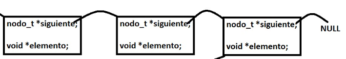

<div align="right">

</div>

# TDA HASH

## Repositorio de Santiago Henseler - 110732 - shenseler@fi.uba.com

- Para compilar:

```bash
make prueba_alumno
```

- Para ejecutar:

```bash
./prueba_alumno
```

- Para ejecutar con valgrind:
```bash
make valgrind_alumno
```
---
##  ¿Que es un diccionario?

Un diccionario es un T.D.A. el cual permite almacenar y organizar información en pares clave-valor. Cada elemento en un diccionario consiste en una clave única y un valor asociado. La clave funciona como un identificador único y se utiliza para acceder al valor correspondiente de una manera más eficaz.

Las ventajas de este T.D.A. salen a la luz en las operaciónes de buscar, insertar y modificar rápidamente datos. En general, puede variar con la implementación, las operaciones eficientes son `O(1)`.

<div align="center">

</div>

---
##  ¿Que es una función de hash?
Una función de hash, es una función matematica que toma un valor de entrada (como un string o un entero) y lo transforma, a partir de unas operaciones, en otro valor que generalmente es un número entero. Su propósito principal es acotar el dominio de los datos, de tamaño variable a datos de tamaño fijo de manera determinada.

Una buena función de hash debe tener las siguientes propiedades:

-Uniformidad: Debe distribuir los valores de entrada de manera uniforme para minimizar las colisiones.
-Eficiencia: Debe calcularse de manera eficiente para no generar retrasos significativos en las operaciones que lo utilizan.
-Determinismo: Para un mismo valor de entrada, siempre debe producir el mismo valor hash.
-Resistencia a colisiones: Debe ser poco probable que dos valores distintos produzcan el mismo valor hash.

<div align="center">

</div>

---
##  ¿Que es una tabla de hash?
Una tabla de hash, es una implementación del T.D.A. diccionario  en el cual se utiliza una función de hash para agrupar claves de manera eficiente dentro del diccionario.

En una tabla de hash los datos se distribuyen en un vector. La función de hash toma la clave como entrada y calcula un índice correspondiente dentro del rango de las casillas disponibles. Luego, el valor asociado a la clave se almacena en esa posición de la tabla. Para esta implementación vamos a usar hash abiertos, que consiste en que los elementos no son insertados en la tabla de hash directamente. Los elementos están fuera de la tabla de hash. Por el otro lado, se lo conoce como direccionamiento cerrado ya que los elementos son insertados en la posición que devuelve la clave hasheada. Los pares (clave, valor) van a estar organizados con nodos enlazados. 

<div align="center">

</div>

Una de las ventajas principales de las tablas de hash es su alta velocidad de búsqueda y recuperación de datos. Dado que la función de hash permite obtener directamente la posición en la tabla donde se encuentra el valor deseado, el acceso a la información es muy rápido, en promedio, con un tiempo de búsqueda constante `O(1)`, Si la función de hash está bien implementada.

Sin embargo, es importante destacar que en ciertos casos, puede ocurrir una colisión de hash. Esto sucede cuando dos claves diferentes generan el mismo índice de casilla. Para manejar estas colisiones, en la implementación que hice, simplemente se añade al final de los nodos enlazados. Para que la implementación no pierda eficacia, cuando la tabla de hash llega a una cantidad de elementos almacenados aplico la función `rehash()`. Esta función crear un hash nuevo con el doble de cantidad que el hash anterior y luego copia todos los elementos del viejo hash al nuevo. Para minimizar la cantidad de nodos que esten enlazados y mantener un tiempo de búsqueda constante `O(1)`.


